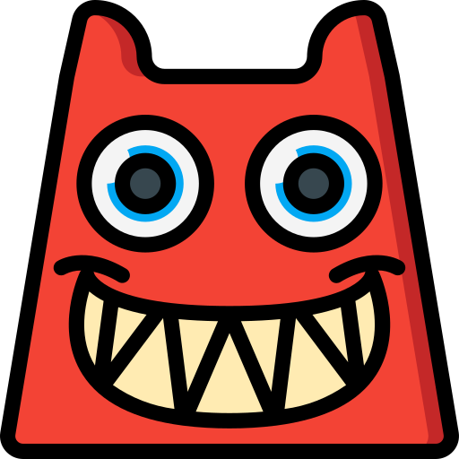

## Instalation
- `$ cp .env.example .env`
- add discord token in `.env`
- `$ make start`

## Features
### Music
- any message starting with `;;play` is deleted if it's not sent on `music`
channel
### Github
- on `pull-requests` channel, only Github pull requests links are allowed
